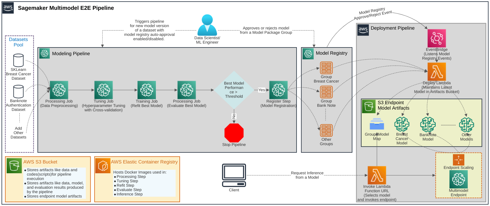

# Terraform a Scalable Comprehensive Sagemaker MultiModel Pipeline

This project provides an end-to-end comprehensive scalable SageMaker pipeline for training and deploying multiple models trained on different datasets to a single endpoint.

## Overview
The Amazon Sagemaker Pipeline allows for the definition and management of machine learning workflows, including data preprocessing, model training, model tuning, and model deployment. These workflows are orchestrated through a sequence of steps and parameters, which can be customized for different machine learning tasks.

The main goal of this project is to provide a reference implementation for building an end-to-end scalable multimodel pipeline with Amazon Sagemaker. Multi-model endpoints provide a scalable and cost-effective solution to deploying a large number of models. They use the same fleet of resources and a shared serving container to host all of your models. This reduces hosting costs by improving endpoint utilization compared to using single-model endpoints. The pipeline is designed to tune, train and deploy multiple models on individual datasets the user wants to work with. It also provides a `Terraform` script that manages all the AWS resources involved in the pipeline. Refer to the following architecture diagram to understand the components involved and their relationship with each other in overall pipeline.
## Architecture

The pipeline is divided into two sections:
### Modeling Pipeline
This includes the following steps:

- Preprocessing: Cleaning and transforming raw data to suitable format for model training.
- Hyperparameter Tuning: Searching for the best hyperparameters for the model.
- Refit Best Model: Training the model with the best hyperparameters.
- Evaluate Best Model: Evaluating the performance of the best model.
- Registration Metric Check: Checking the model's performance metrics to decide whether to register model in registry.
- Model Package Registration Step: Registering the trained model to SageMaker Model Registry.

### Deployment Pipeline
This pipeline listens to Approval/rejection events in SageMaker Model Registry via EventBridge and deploys models to an endpoint's multimodel artifact location in S3 using a Lambda function. Another AWS Lambda with Function URL is used to interact with the Sagemaker endpoint, which is made scalable by Application Auto Scaling.

## Project Structure

```
sagemaker-e2e-pipeline
├── docs
│   ├── images/*            # Directory containing images for documentation
│   ├── CONTRIBUTING.md     # Contribution Guidelines
│   ├── USAGE_GUIDELINE.md  # Usage Guidelines
├── image                   # Directory for Docker Images used in the pipeline
│   ├── Dockerfile          # Dockerfile extended from Sagemaker official SKLearn's Image
│   ├── build_and_push.sh   # Scripts
├── lambda                  # Directory for lambda function files
│   ├── endpoint_deploy.py  # Deployment lambda handler
│   ├── endpoint_invoke.py  # Inference lambda handler
├── scripts                 # Directory for scripts used by different steps of the pipeline
│   ├── estimators          # Directory for training scripts for all the models used in tuning step
│   │   ├── LightGBM.py     # Training Script for LightGBM model
│   │   ├── NeuralNet.py    # Training Script for NeuralNet model
│   │   └── ...             # Training Scripts for other models
│   ├── evaluate.py         # Best model evaluation script on test split
│   ├── inference.py        # Script used by endpoint during inference
│   ├── preprocessing.py    # Script used in preprocessing step
│   └── refit.py            # Script that refit model with best parameters found in tuning step
├── main.tf                 # Terraform file containing configuration for AWS Resources used in the pipeline
├── pipeline.py             # Sagemaker pipeline definition
├── requirements.txt        # Python dependencies
├──.gitignore               # gitignore
├── LICENSE                 # License file
└── README.md               # This file
```

## Implementation Details
For implementation details, please read my blog: [Terraform a Scalable Comprehensive Sagemaker MultiModel Pipeline](https://spktsagar.com/posts/2020/07/terraform-sagemaker-multimodel-pipeline/)

## Usage
To use the pipeline, please read the [usage guideline](docs/USAGE_GUIDELINE.md).

## Contributing
Contributions are welcome! Please read the [contributing guidelines](docs/CONTRIBUTING.md) before getting started.


